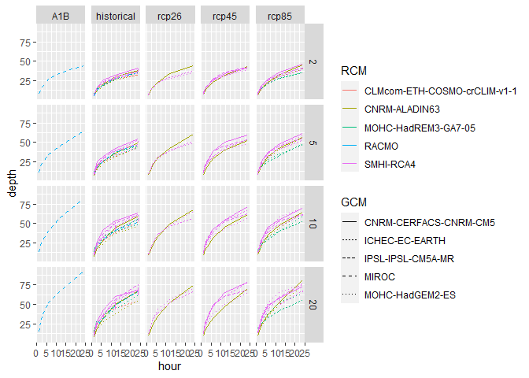
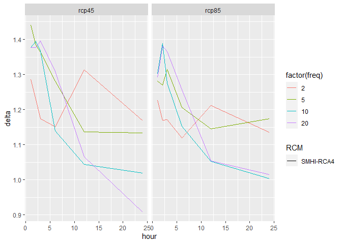

The Precip Modeling Package
================

# Package for Advanced R Programming class with precipitation data and functions

## Installation of package from github

``` r
devtools::install_github("https://github.com/kazivana/precipmodeling.git")
```

## Sample of local single data set used for testing function

Includes dates, precipitation and model name (forcing) columns

``` r
dta <- readRDS('C:/Users/godzi/Documents/avancedr/precip/CZ_pr_EUR-11_CNRM-CERFACS-CNRM-CM5_historical_r1i1p1_CNRM-ALADIN63_v2_1hr.rds')
```

## Sample: Get Maxima function

Get Maxima values for Precipitation from dta dataset

``` r
head(getMX(dta, a = c(1,2,3,6,12,24)))
```

    ##    year agg       mx
    ## 1: 1951   1 4.319973
    ## 2: 1951   2 4.319973
    ## 3: 1951   3 4.319973
    ## 4: 1951   6 4.319973
    ## 5: 1951  12 4.319973
    ## 6: 1951  24 4.319973

## Sample: DDF (depth-duration-frequency) function

Using function to split the dataset for hourly duration and frequency
for DDF curves

``` r
ddff(dta, frequency = c(2,5,10,20))
```

    ##     Duration     depth freq hour
    ##  1:       D1  5.467910    2    1
    ##  2:       D1  6.849683    5    1
    ##  3:       D1  7.535927   10    1
    ##  4:       D1  8.020538   20    1
    ##  5:       D2  9.964763    2    2
    ##  6:       D2 12.377329    5    2
    ##  7:       D2 13.226612   10    2
    ##  8:       D2 14.051122   20    2
    ##  9:       D3 12.988917    2    3
    ## 10:       D3 16.480279    5    3
    ## 11:       D3 17.987438   10    3
    ## 12:       D3 19.192825   20    3
    ## 13:       D6 21.211284    2    6
    ## 14:       D6 25.517393    5    6
    ## 15:       D6 28.576816   10    6
    ## 16:       D6 32.377855   20    6
    ## 17:      D12 29.551979    2   12
    ## 18:      D12 36.321244    5   12
    ## 19:      D12 43.541245   10   12
    ## 20:      D12 50.557555   20   12
    ## 21:      D24 38.116883    2   24
    ## 22:      D24 49.170392    5   24
    ## 23:      D24 59.411640   10   24
    ## 24:      D24 66.978165   20   24
    ##     Duration     depth freq hour

## Using package data

Plotting aggregated maximum depths of multiple models

``` r
ggplot(depth_maxima) + 
  geom_line(aes(x = hour, y = depth, col = RCM, lty = GCM)) + 
  facet_grid(factor(freq) ~ RCP)
```

<!-- -->

## Sample of local list of files

``` r
fls <- list.files(path = "C:/Users/godzi/Documents/avancedr/spatial/data/raw_short",
                  pattern = ".nc",
                  full.names = TRUE)
```

## Sample: All Precipitation function

Plotting hourly precipitation data

``` r
a = allprecip(fls[1])
plot(a)
```

<!-- -->

## Sample: Single Precipitation to plot function

Plotting precipitation data with Prague geospatial data visualization

``` r
singleprecip(fls[1], 1)
```

<!-- -->

## Showcasing delta dataset

The change in historical and future projected precipitation based on
“IPSL-IPSL-CM5A-MR” GLobal Climate Model

``` r
ggplot(delta[GCM == "IPSL-IPSL-CM5A-MR", .(hour, delta, freq, RCP, RCM)]) +
  geom_line(aes(x = hour, y = delta, col = factor(freq), lty = RCM)) +
  facet_grid(.~RCP)
```

<!-- -->

## Sample: Get Precipitation DataFrame function

Returns a dataframe with date, precipitation, latitute, longitute and
model name, aggregated from multiple datasets

``` r
r = getPrecipDF(fls)
r
```

    ##                         date  id precipitation      lon      lat
    ##       1: 1951-01-01 00:30:00 522  2.550140e-07 14.07650 50.25525
    ##       2: 1951-01-01 01:30:00 522  4.574551e-06 14.07650 50.25525
    ##       3: 1951-01-01 02:30:00 522  2.258878e-06 14.07650 50.25525
    ##       4: 1951-01-01 03:30:00 522  6.262562e-07 14.07650 50.25525
    ##       5: 1951-01-01 04:30:00 522  4.210534e-08 14.07650 50.25525
    ##      ---                                                        
    ## 1753436: 1960-12-31 19:30:00 653  8.565443e-08 14.77947 49.89556
    ## 1753437: 1960-12-31 20:30:00 653  3.285064e-08 14.77947 49.89556
    ## 1753438: 1960-12-31 21:30:00 653  7.425014e-09 14.77947 49.89556
    ## 1753439: 1960-12-31 22:30:00 653  5.266188e-09 14.77947 49.89556
    ## 1753440: 1960-12-31 23:30:00 653  2.563814e-09 14.77947 49.89556
    ##                                                        model
    ##       1: ACS-CNRM-CM5_historical_r1i1p1_CNRM-ALADIN63_v2_1hr
    ##       2: ACS-CNRM-CM5_historical_r1i1p1_CNRM-ALADIN63_v2_1hr
    ##       3: ACS-CNRM-CM5_historical_r1i1p1_CNRM-ALADIN63_v2_1hr
    ##       4: ACS-CNRM-CM5_historical_r1i1p1_CNRM-ALADIN63_v2_1hr
    ##       5: ACS-CNRM-CM5_historical_r1i1p1_CNRM-ALADIN63_v2_1hr
    ##      ---                                                    
    ## 1753436: ACS-CNRM-CM5_historical_r1i1p1_CNRM-ALADIN63_v2_1hr
    ## 1753437: ACS-CNRM-CM5_historical_r1i1p1_CNRM-ALADIN63_v2_1hr
    ## 1753438: ACS-CNRM-CM5_historical_r1i1p1_CNRM-ALADIN63_v2_1hr
    ## 1753439: ACS-CNRM-CM5_historical_r1i1p1_CNRM-ALADIN63_v2_1hr
    ## 1753440: ACS-CNRM-CM5_historical_r1i1p1_CNRM-ALADIN63_v2_1hr

## Saved dataframe of the precipitation data used in class, derived from getPrecipDF function

``` r
precip
```

    ##                Date  Time  id Precipitation Longtitude Latitude
    ##       1: 1950-12-31 00:30 522  2.550140e-07   14.07650 50.25525
    ##       2: 1951-01-01 01:30 522  4.574551e-06   14.07650 50.25525
    ##       3: 1951-01-01 02:30 522  2.258878e-06   14.07650 50.25525
    ##       4: 1951-01-01 03:30 522  6.262562e-07   14.07650 50.25525
    ##       5: 1951-01-01 04:30 522  4.210534e-08   14.07650 50.25525
    ##      ---                                                       
    ## 1928636: 1961-12-31 19:30 653  3.655536e-08   14.77947 49.89556
    ## 1928637: 1961-12-31 20:30 653  3.743742e-08   14.77947 49.89556
    ## 1928638: 1961-12-31 21:30 653  4.509362e-08   14.77947 49.89556
    ## 1928639: 1961-12-31 22:30 653  4.206945e-08   14.77947 49.89556
    ## 1928640: 1961-12-31 23:30 653  1.910721e-08   14.77947 49.89556
    ##                                                Climate Model
    ##       1: ACS-CNRM-CM5_historical_r1i1p1_CNRM-ALADIN63_v2_1hr
    ##       2: ACS-CNRM-CM5_historical_r1i1p1_CNRM-ALADIN63_v2_1hr
    ##       3: ACS-CNRM-CM5_historical_r1i1p1_CNRM-ALADIN63_v2_1hr
    ##       4: ACS-CNRM-CM5_historical_r1i1p1_CNRM-ALADIN63_v2_1hr
    ##       5: ACS-CNRM-CM5_historical_r1i1p1_CNRM-ALADIN63_v2_1hr
    ##      ---                                                    
    ## 1928636: ACS-CNRM-CM5_historical_r1i1p1_CNRM-ALADIN63_v2_1hr
    ## 1928637: ACS-CNRM-CM5_historical_r1i1p1_CNRM-ALADIN63_v2_1hr
    ## 1928638: ACS-CNRM-CM5_historical_r1i1p1_CNRM-ALADIN63_v2_1hr
    ## 1928639: ACS-CNRM-CM5_historical_r1i1p1_CNRM-ALADIN63_v2_1hr
    ## 1928640: ACS-CNRM-CM5_historical_r1i1p1_CNRM-ALADIN63_v2_1hr
